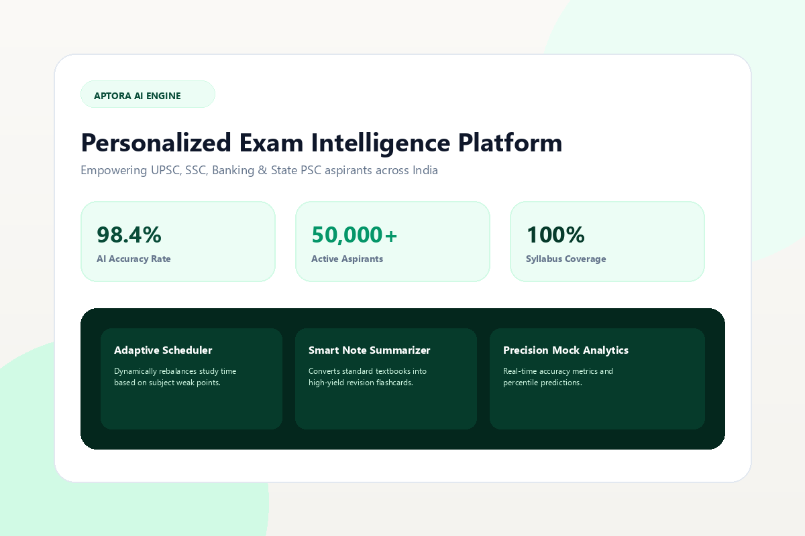
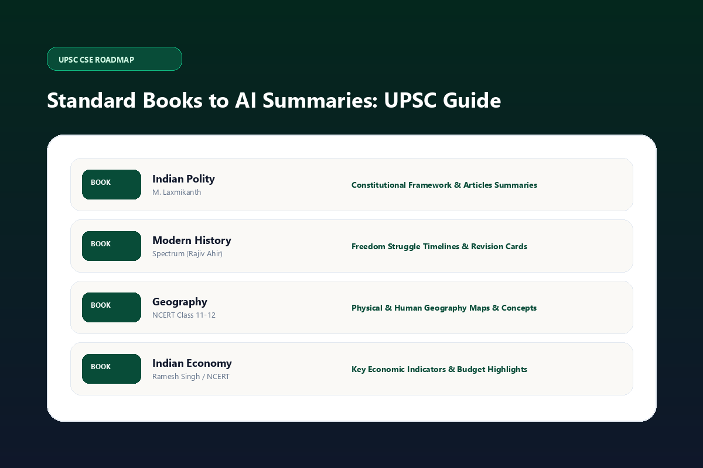
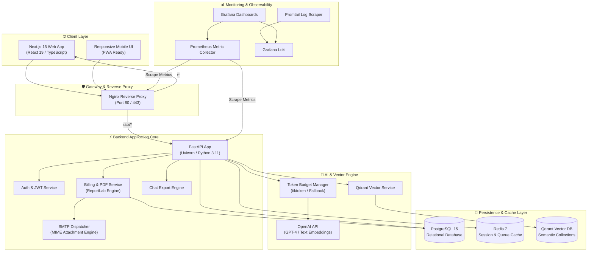
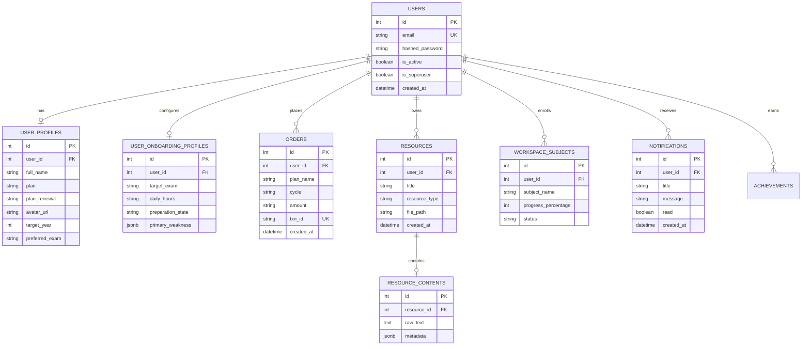
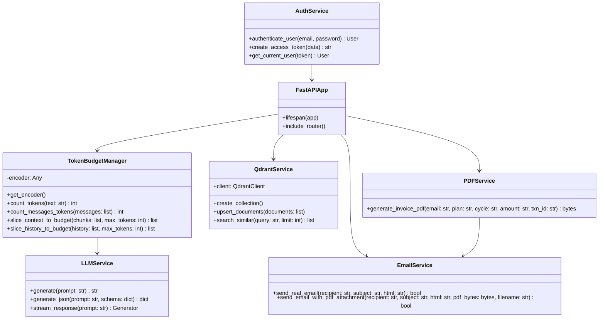

# 🚀 Aptora —  AI Exam Prepration Platform

<p align="center">
  
  
  
  
  
  
  
  
</p>

---

## 📖 Executive Summary

**Aptora** (*Study Katta / AI Prep Engine*) is an enterprise-grade, multi-tenant AI educational ecosystem designed to accelerate competitive examination success (UPSC, SSC, GATE, Banking, & State PSCs). 

By combining **RAG (Retrieval-Augmented Generation)**, **Qdrant Vector Embeddings**, **OpenAI LLMs**, **ReportLab PDF Invoicing**, and an **Animated Glassmorphism Next.js 15 App Router Frontend**, Aptora delivers personalized learning paths, instant mock test generation, active-recall study notes, and real-time performance analytics.

---

## 🎨 Aptora UI Showcase & Visual Previews

### 1. 🌐 Landing Page & Platform Overview (`/`)
* **Design Aesthetic**: Premium Deep Emerald (`#084C38`) & Warm Off-White (`#FAF9F6`) canvas layout with glassmorphism and 3D micro-animations.
* **Key Sections**: Hero with interactive particle banner, Feature Grid, AI Automation Flow, Pricing Matrix with GST breakdown, Synced FAQs, and Compact CTA Banner.

<p align="center">
  
</p>

---

### 2. 📊 Student Dashboard & Interactive Study Engine (`/dashboard`)
* **Features**: Live study goal rings, streak counter, daily AI recommended study tasks, recent activity history, and interactive pomodoro study cards.

<p align="center">
  
</p>

---

### 3. 🤖 AI Coach & RAG Knowledge Engine (`/dashboard/coach`)
* **Features**: Real-time conversational AI mentor with token budget optimization, syllabus context awareness, Markdown streaming, and direct PDF note export.

<p align="center">
  
</p>

---

### 4. 🎯 Custom Mock Exam & Practice Hub (`/exams`)
* **Features**: Timed exam simulations, instant option evaluation, active-recall explanation cards, and subject-wise accuracy tracking.

<p align="center">
  
</p>

---

### 5. 📚 Digital Syllabus & Resource Library (`/dashboard/ai-sources`)
* **Features**: Structured book upload, past year question (PYQ) indexing, and syllabus milestone mapping.

<p align="center">
  
</p>

---

### 6. 📄 Automatic PDF Invoice & Checkout (`/checkout/success`)
* **Features**: Live payment verification, confetti celebration, automated ReportLab PDF invoice generation with 18% GST breakdown, and direct SMTP email dispatch with attached PDF.

---

## 🏗 System Architecture & Topology



---

## 🗄 Entity-Relationship (ER) Diagram



---

## 🧩 Software Class Diagram



---

## 🛠 Technology Stack

| Domain | Framework / Library | Purpose |
| :--- | :--- | :--- |
| **Frontend UI** | **Next.js 15.5.20 App Router** | React 19 SSR, RSC, and route optimization |
| **Styling & Motion** | **Vanilla CSS, Tailwind 4, Framer Motion** | Glassmorphism, 3D bubble pop, micro-interactions |
| **Backend Core** | **FastAPI 0.139.0** | Async Python API gateway with Pydantic validation |
| **Relational Database** | **PostgreSQL 15** | User profiles, subscriptions, orders, and resources |
| **Cache & Queue** | **Redis 7** | Session cache, OTP throttle, and task state |
| **Vector Engine** | **Qdrant** | High-performance embedding storage & RAG retrieval |
| **PDF Engine** | **ReportLab 5.0.0** | Pixel-perfect vector PDF invoice generation |
| **Email Gateway** | **Python `smtplib` + MIME** | Multi-part HTML & PDF attachment dispatch |
| **AI LLM Integration** | **OpenAI API & `tiktoken`** | GPT-4 reasoning, prompt slicing, and embeddings |
| **Container & Proxy** | **Docker Compose & Nginx** | Unified multi-container deployment & reverse proxy |
| **Observability** | **Prometheus, Grafana, Loki** | Distributed metrics, log aggregation, & alerts |

---

## 📂 Project Directory Structure

```
Exam_Forge/
├── docker/                         # Multi-stage Dockerfiles
│   ├── backend.Dockerfile          # Production Python 3.11 backend image
│   ├── backend.dev.Dockerfile      # Live reload backend image
│   ├── frontend.Dockerfile         # Production Next.js standalone runner
│   ├── frontend.dev.Dockerfile     # Live HMR frontend image
│   └── nginx/nginx.conf            # Container Nginx config
│
├── nginx/                          # Root Nginx Reverse Proxy config
│   └── nginx.conf
│
├── monitoring/                     # Prometheus & Grafana Observability
│   ├── prometheus.yml
│   ├── promtail-config.yml
│   └── loki-config.yml
│
├── backend/                        # FastAPI Backend Application
│   ├── app/
│   │   ├── ai/                     # RAG & LLM Orchestration
│   │   │   ├── orchestrator/       # Reasoning & Context Optimizers
│   │   │   └── services/           # Qdrant, TokenBudgetManager, LLMService
│   │   ├── api/v1/                 # REST Routers (Auth, Billing, Workspace, Chat)
│   │   ├── core/                   # Security, JWT, Config Settings
│   │   ├── db/                     # SQLAlchemy Base, Sessions & Migrations
│   │   ├── models/                 # ORM Database Schema Definitions
│   │   ├── schemas/                # Pydantic Request & Response Contracts
│   │   └── services/               # PDF Engine & Email Dispatcher
│   ├── tests/                      # Pytest suite (37 unit & API tests)
│   └── Dockerfile
│
├── frontend/                       # Next.js 15 App Router Frontend
│   ├── public/                     # Canvas vector PNG assets & brand icons
│   ├── src/
│   │   ├── app/                    # App Router pages (Landing, Dash, Checkout)
│   │   ├── components/             # UI Design System, Modals, Navbar, Footer
│   │   ├── contexts/               # React Context Providers (GoalEngine, Auth)
│   │   ├── features/               # AI Workspace, Knowledge Engine, Planner
│   │   └── middleware.ts           # Route matcher & manifest generator
│   ├── next.config.ts              # Asset header & transpile rules
│   └── package.json
│
├── docker-compose.yml              # Base Docker Compose Services
├── docker-compose.dev.yml          # Local Dev Environment Override
├── docker-compose.monitoring.yml   # Prometheus/Grafana Stack
├── Taskfile.yml                    # Automated CLI Command Runner
└── README.md                       # Master Documentation
```

---

## ⚡ Quickstart & Deployment Guide

### Option 1: One-Command Docker Compose (Recommended)

To spin up the complete Aptora stack (PostgreSQL, Redis, Qdrant, Backend, Frontend, and Nginx):

```bash
# Clone the repository
git clone https://github.com/Aniket-Athanikar/Exam_Forge.git
cd Exam_Forge

# Start all containers in background
docker compose up --build -d
```

Access services:
* **Frontend Web App**: `http://localhost:80`
* **FastAPI Backend Swagger**: `http://localhost:8000/docs`
* **Qdrant Vector Dashboard**: `http://localhost:6433/dashboard`

---

### Option 2: Using Taskfile Automation CLI

Aptora provides a pre-configured `Taskfile.yml` for unified operations:

```bash
# Start local development stack with hot reloading
task dev

# Start Aptora monitoring stack (Prometheus & Grafana)
task monitoring

# View status of active services
task status

# Tail logs across all containers
task logs

# Run backend unit tests with coverage
task test

# Perform clean frontend build validation
task test-frontend

# Stop all containers
task down
```

---

### Option 3: Manual Local Development Setup

#### 1. Backend Environment Setup (`/backend`)

```bash
cd backend

# Create virtual environment
python -m venv .venv
source .venv/bin/activate  # On Windows: .venv\Scripts\activate

# Install dependencies
pip install -r requirements.txt

# Configure Environment Variables (.env)
cp .env.example .env

# Run FastAPI Server
python -m uvicorn app.main:app --host 0.0.0.0 --port 8000 --reload
```

#### 2. Frontend Setup (`/frontend`)

```bash
cd frontend

# Install dependencies
npm install

# Clear stale cache and start dev server
npm run dev:clean
```

---

## ⚙️ Environment Configuration (`.env`)

Create a `.env` file inside `backend/`:

```env
# General
PROJECT_NAME=Aptora
ENV=development
SECRET_KEY=your_super_secret_jwt_key_here

# PostgreSQL Database
DB_HOST=localhost
DB_PORT=5433
DB_NAME=aptora_db
DB_USER=aptora_user
DB_PASSWORD=admin123

# Redis & Qdrant
REDIS_HOST=localhost
REDIS_PORT=6479
QDRANT_HOST=localhost
QDRANT_PORT=6433
QDRANT_COLLECTION=aptora_documents

# OpenAI API Key
OPENAI_API_KEY=sk-proj-xxxxxxxxxxxxxxxxxxxxxxxx
OPENAI_MODEL=gpt-4o-mini
OPENAI_EMBEDDING_MODEL=text-embedding-3-small

# SMTP Email Configuration (For Invoice PDF Dispatch)
MAIL_SERVER=smtp.gmail.com
MAIL_PORT=587
MAIL_USERNAME=agentforge29@gmail.com
MAIL_PASSWORD=your_app_password
```

---

## 🧪 Testing & Verification

```bash
# Execute Backend Pytest Suite
cd backend
python -m pytest tests/ -v

# Execute Frontend Build Validation
cd frontend
npm run build
```

---

## 📜 License
This project is licensed under the **MIT License**. See the [LICENSE](LICENSE) file for details.

---

## 👥 Engineering & Author Credits

* **Mrunal Chaudhari** — *Full Stack AI Architect* (FastAPI, Qdrant RAG Engine, ReportLab PDF Service, Security)
* **Aniket Athanikar** — *Frontend & UI/UX Architect* (Next.js 15, Framer Motion, Design Systems, Tailwind)

<p align="center">
  ⭐ <b>If you find Aptora useful for your AI prep workflows, please consider starring this repository!</b>
</p>
