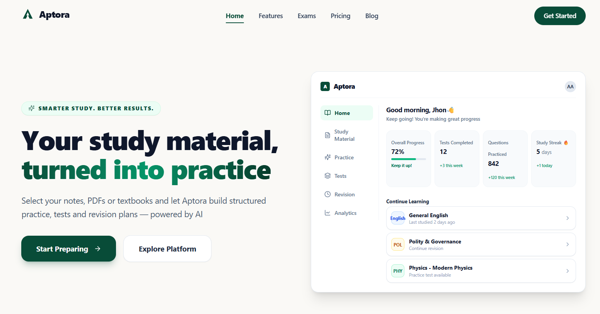
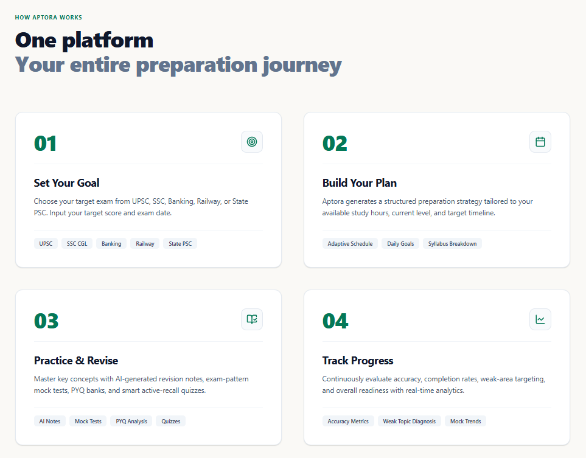
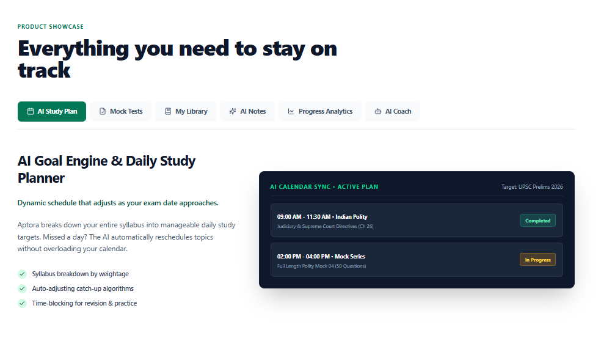
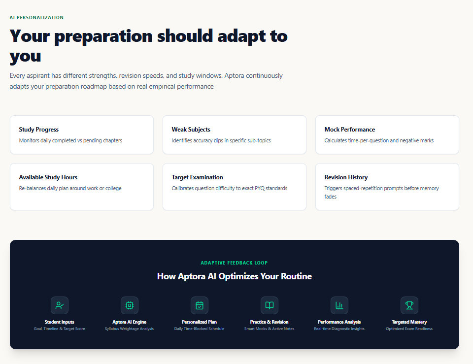
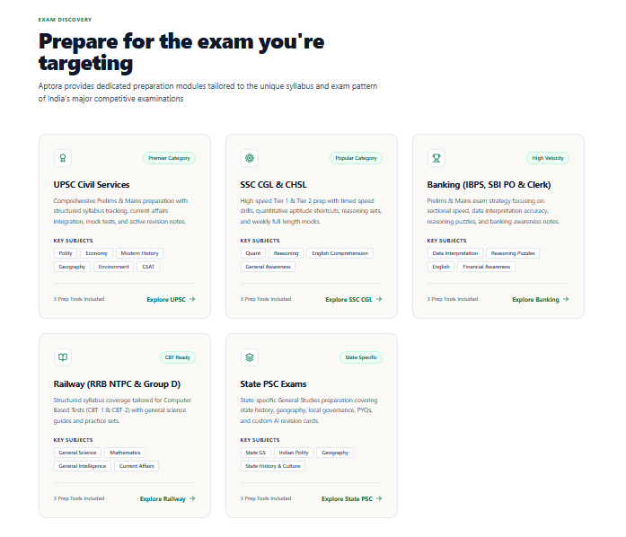
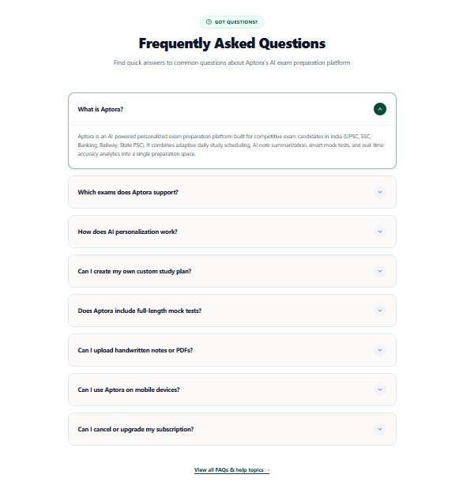
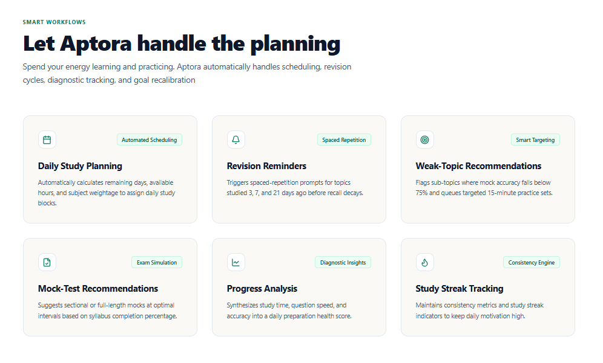
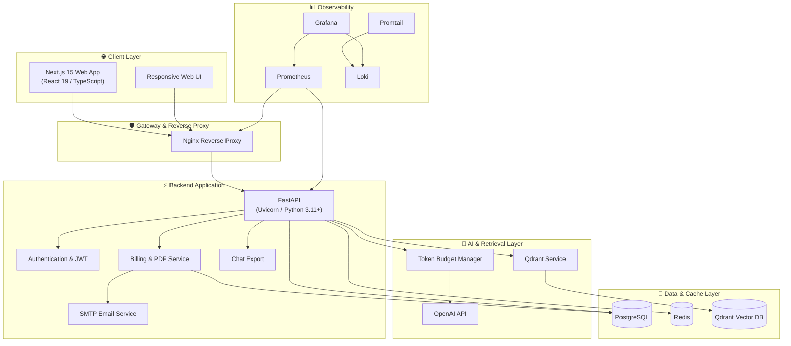
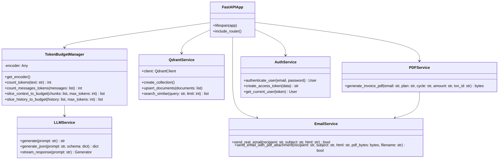

# 🚀 Aptora — AI Exam Preparation Platform

<p align="center">
  
  
  
  
  
  
  
  
</p>

---

## 📖 Overview

**Aptora** is an AI-powered exam preparation platform designed to help students organize their preparation, study with contextual AI assistance, work with learning resources, practice through mock examinations, and track their progress.

The platform combines a modern **Next.js frontend**, **FastAPI backend**, **PostgreSQL**, **Redis**, **Qdrant Vector Database**, and **LLM-powered retrieval workflows** to provide an integrated learning environment.

Aptora focuses on turning a student's study material and preparation goals into a structured learning experience through:

* 🤖 AI-powered study assistance
* 📚 Personal learning resources
* 🔎 Retrieval-Augmented Generation (RAG)
* 📝 AI-generated study notes
* 🎯 Mock examination workflows
* 📊 Study progress and performance tracking
* 📅 Personalized study planning
* 🔐 Secure authentication and account management
* 📄 Automated PDF invoice generation
* 📧 Email delivery with PDF attachments

---

# 🎨 Aptora UI Showcase

## 1. 🌐 Landing Page & Platform Overview

The Aptora landing page introduces the platform, its learning capabilities, AI workflows, resources, pricing, FAQs, and primary calls to action.

### Landing Page Screens

<table>
  <tr>
    <td width="50%">
      
    </td>
    <td width="50%">
      
    </td>
  </tr>
  <tr>
    <td width="50%">
      
    </td>
    <td width="50%">
      
    </td>
  </tr>
  <tr>
    <td width="50%">
      
    </td>
    <td width="50%">
      
    </td>
  </tr>
  <tr>
    <td width="50%">
      
    </td>
    <td></td>
  </tr>
</table>

---

## 2. 🤖 AI Study Flow & Conversational Learning

Aptora provides a conversational AI study workflow designed to guide students through multiple stages of contextual learning.

The following screens demonstrate the AI study journey from the initial interaction through the different stages of the learning workflow.

### AI Study Flow — 7 Stages

<table>
  <tr>
    <td width="50%">
      
    </td>
    <td width="50%">
      
    </td>
  </tr>
  <tr>
    <td width="50%">
      
    </td>
    <td width="50%">
      
    </td>
  </tr>
  <tr>
    <td width="50%">
      
    </td>
    <td width="50%">
      
    </td>
  </tr>
  <tr>
    <td width="50%">
      
    </td>
    <td></td>
  </tr>
</table>

---

## 3. 📊 Student Dashboard & Interactive Study Engine

The dashboard provides students with an overview of their preparation and current study activity.

**Features include:**

* Study goals and progress
* Streak tracking
* Recommended study activities
* Recent activity
* Interactive study sessions
* Pomodoro-style study workflows

<p align="center">
  
</p>

---

## 4. 🎯 Custom Mock Exams & Practice

Aptora supports structured practice and mock examination workflows.

**Features include:**

* Timed examination sessions
* Question and option evaluation
* Answer explanations
* Subject-wise practice
* Performance tracking

<p align="center">
  
</p>

---

## 5. 📚 Digital Syllabus & Resource Library

Students can organize learning resources and reference material inside the platform.

**Features include:**

* Learning resource management
* Book and document organization
* Previous Year Question (PYQ) resources
* Syllabus-oriented preparation
* Resource indexing for AI-assisted workflows

<p align="center">
  
</p>

---

# 🏗 System Architecture



---

# 🗄 Entity-Relationship Diagram


---

# 🧩 Software Class Diagram



---

# 🛠 Technology Stack

| Domain               | Technology               | Purpose                                  |
| :------------------- | :----------------------- | :--------------------------------------- |
| **Frontend**         | **Next.js 15.5.20**      | Application framework and routing        |
| **UI Library**       | **React 19.1.0**         | Component-based UI                       |
| **Styling**          | **CSS / Tailwind CSS**   | Responsive interface and design system   |
| **Animation**        | **Framer Motion**        | UI interactions and animations           |
| **Backend**          | **FastAPI 0.139.0**      | High-performance Python REST API         |
| **Language**         | **Python 3.11+**         | Backend and AI services                  |
| **Database**         | **PostgreSQL 15**        | Persistent relational data               |
| **Cache**            | **Redis 7**              | Caching, OTP throttling, and task state  |
| **Vector Database**  | **Qdrant**               | Embedding storage and semantic retrieval |
| **AI Integration**   | **OpenAI API**           | LLM generation and embeddings            |
| **Token Management** | **tiktoken**             | Token counting and context management    |
| **PDF Generation**   | **ReportLab**            | Invoice PDF generation                   |
| **Email**            | **smtplib + MIME**       | Transactional email and attachments      |
| **Containerization** | **Docker Compose**       | Multi-service development and deployment |
| **Reverse Proxy**    | **Nginx**                | Request routing and service proxying     |
| **Monitoring**       | **Prometheus + Grafana** | Metrics and system monitoring            |
| **Logging**          | **Loki + Promtail**      | Centralized log collection               |

---

# 📂 Project Directory Structure

```text
Aptora/
│
├── backend/
│   ├── app/
│   │   ├── ai/
│   │   │   ├── orchestrator/
│   │   │   └── services/
│   │   ├── api/
│   │   │   └── v1/
│   │   ├── core/
│   │   ├── db/
│   │   ├── models/
│   │   ├── schemas/
│   │   └── services/
│   │
│   ├── tests/
│   ├── Dockerfile
│   └── requirements.txt
│
├── frontend/
│   ├── public/
│   │   ├── 1.png
│   │   ├── 2.png
│   │   ├── 3.png
│   │   ├── 4.png
│   │   ├── 5.png
│   │   ├── 6.png
│   │   ├── 7.png
│   │   ├── stage-1.png
│   │   ├── stage-2.png
│   │   ├── stage-3.png
│   │   ├── stage-4.png
│   │   ├── stage-5.png
│   │   ├── stage-6.png
│   │   ├── stage-7.png
│   │   └── other UI assets
│   │
│   ├── src/
│   │   ├── app/
│   │   ├── components/
│   │   ├── contexts/
│   │   ├── features/
│   │   └── middleware.ts
│   │
│   ├── next.config.ts
│   └── package.json
│
├── nginx/
│   └── nginx.conf
│
├── monitoring/
│   ├── prometheus.yml
│   ├── promtail-config.yml
│   └── loki-config.yml
│
├── docker-compose.yml
├── docker-compose.dev.yml
├── docker-compose.monitoring.yml
├── Taskfile.yml
├── LICENSE
└── README.md
```

---

# ⚡ Quickstart

## Option 1 — Docker Compose

Docker Compose is the recommended way to run the complete Aptora stack.

### Clone the repository

```bash
git clone https://github.com/Aniket-Athanikar/Aptora.git
cd Aptora
```

### Start the application

```bash
docker compose up --build -d
```

### Access the services

| Service              | URL                               |
| :------------------- | :-------------------------------- |
| **Aptora Web App**   | `http://localhost:80`             |
| **FastAPI Swagger**  | `http://localhost:8000/docs`      |
| **Qdrant Dashboard** | `http://localhost:6433/dashboard` |

---

# 🧰 Taskfile Commands

Aptora includes a `Taskfile.yml` for common development operations.

```bash
# Start development environment
task dev

# Start monitoring services
task monitoring

# View container status
task status

# View application logs
task logs

# Run backend tests
task test

# Validate frontend build
task test-frontend

# Stop services
task down
```

---

# 💻 Manual Development Setup

## Backend

```bash
cd backend

# Create virtual environment
python -m venv .venv
```

### Windows

```bash
.venv\Scripts\activate
```

### Linux / macOS

```bash
source .venv/bin/activate
```

Install dependencies:

```bash
pip install -r requirements.txt
```

Create your environment file:

```bash
cp .env.example .env
```

Start the FastAPI server:

```bash
python -m uvicorn app.main:app --host 0.0.0.0 --port 8000 --reload
```

---

## Frontend

```bash
cd frontend

npm install
npm run dev
```

---

# ⚙️ Environment Configuration

Create a `.env` file inside the `backend/` directory.

```env
PROJECT_NAME=Aptora
ENV=development

SECRET_KEY=your_secret_key

# PostgreSQL
DB_HOST=localhost
DB_PORT=5433
DB_NAME=aptora_db
DB_USER=aptora_user
DB_PASSWORD=your_database_password

# Redis
REDIS_HOST=localhost
REDIS_PORT=6479

# Qdrant
QDRANT_HOST=localhost
QDRANT_PORT=6433
QDRANT_COLLECTION=aptora_documents

# OpenAI
OPENAI_API_KEY=your_openai_api_key
OPENAI_MODEL=gpt-4o-mini
OPENAI_EMBEDDING_MODEL=text-embedding-3-small

# SMTP
MAIL_SERVER=smtp.gmail.com
MAIL_PORT=587
MAIL_USERNAME=your_email
MAIL_PASSWORD=your_app_password
```

> **Security:** Never commit `.env`, API keys, passwords, SMTP credentials, tokens, or other secrets to the repository. Use `.env.example` for safe configuration templates.

---

# 🧪 Testing

## Backend Tests

```bash
cd backend
python -m pytest tests/ -v
```

## Frontend Build

```bash
cd frontend
npm run build
```

---

# 🔐 Security

Aptora uses environment-based configuration for sensitive credentials.

The following should **never** be committed to Git:

* API keys
* Database passwords
* JWT secrets
* SMTP passwords
* Access tokens
* Private credentials
* Production environment files

Use `.gitignore` and `.env.example` to separate configuration from source code.

---

# 👥 Engineering & Author Credits

### Aniket Athanikar

**Backend & AI Engineering**

Responsible for the backend architecture and AI engineering, including:

* FastAPI backend
* REST API development
* Authentication and authorization
* JWT-based security
* PostgreSQL integration
* Redis integration
* Qdrant vector database integration
* RAG workflows
* Document processing
* AI/LLM integration
* Token management
* PDF generation
* Email services
* Backend Docker configuration

### Mrunal Chaudhari

**Frontend Engineering & UI/UX**

Responsible for the frontend application and user experience, including:

* Next.js application
* React components
* UI/UX implementation
* Responsive layouts
* Landing page
* Authentication screens
* Dashboard interface
* Learning workflows
* Frontend state and interactions
* Design system and visual implementation

---

# 📜 License

This project is licensed under the **MIT License**.

See the [`LICENSE`](LICENSE) file for details.

---

<p align="center">
  ⭐ <strong>If you find Aptora useful, consider starring the repository.</strong>
</p>

<p align="center">
  <strong>Aptora — Learn smarter. Prepare better.</strong>
</p>
