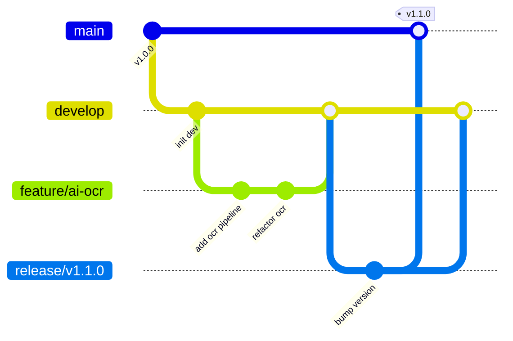

# Git Strategy & Branching Guide

ExamForge AI adopts an enterprise-grade Git strategy to scale collaboration across multi-disciplinary teams (frontend, backend, AI, and DevOps).

## Branch Architecture



- **`main`**: Production code only. Direct commits are forbidden. Changes enter exclusively via approved PRs from `release/*` or `hotfix/*` branches.
- **`develop`**: Integration branch for active features.
- **`feature/*`**: Short-lived branches for new requirements, branching off `develop`.
- **`bugfix/*`**: Bug fixes targeting `develop`.
- **`hotfix/*`**: Critical patches targeting production, branching off `main` and merging back to both `main` and `develop`.
- **`release/*`**: Pre-release builds containing stability adjustments.

## Branch Naming Conventions

Prefix branch names with the domain-specific action:
- `frontend/`: Layout/UI adjustments (e.g. `frontend/dark-mode-dashboard`)
- `backend/`: API additions or modifications (e.g. `backend/oauth-endpoints`)
- `database/`: Schema upgrades and migration revisions
- `devops/`: CI/CD pipelines, Dockerfiles, or Kubernetes upgrades
- `security/`: Encryption, dependency patching, security updates

## Conventional Commits

We enforce the [Conventional Commits](https://www.conventionalcommits.org/) standard on pull request merges.

Format: `<type>(<scope>): <description>`

```bash
feat(ocr): introduce multi-page PDF document processing
fix(auth): resolve token parsing error on token expiration
docs(readme): add docker compose local startup guide
```
